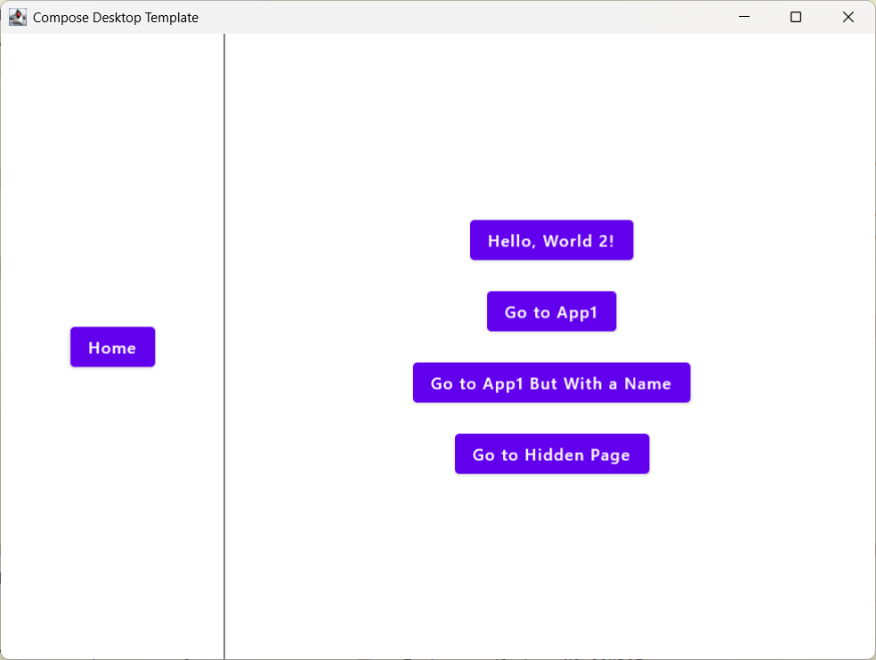

= Compose Desktop Template
:toc: left
:toclevels: 3
:icons: font
:source-highlighter: highlightjs

A template project for creating desktop applications using Jetbrains Compose for Desktop with a focus on simplicity and productivity.

== Overview

This template provides a starting point for building desktop applications using Compose for Desktop. It includes:

* Navigation system with route configuration
* Theming support with light and dark modes
* Custom UI components and extensions
* DSL-like syntax for building UIs

== Libraries

=== Core Libraries

[cols="1,1,2", options="header"]
|===
|Library |Version |Purpose
|Compose for Desktop |1.8.0-rc01 |UI toolkit for building desktop applications with Kotlin
|Kotlin JVM |2.1.20 |Kotlin programming language for JVM
|===

=== Navigation and Routing

[cols="1,1,2", options="header"]
|===
|Library |Version |Purpose
|PreCompose |1.6.2 |Navigation library for Compose applications
|Malefic Nav |1.3.3 |Custom navigation components and utilities
|===

=== UI Components and Theming

[cols="1,1,2", options="header"]
|===
|Library |Version |Purpose
|Malefic Components |1.1.0 |Custom UI components for Compose
|Malefic Theming |1.1.2 |Theming support with JSON configuration
|Malefic Engine |1.3.0 |UI building engine with DSL-like syntax
|===

=== Extensions

[cols="1,1,2", options="header"]
|===
|Library |Version |Purpose
|Malefic Extensions Core |1.4.2 |Core utility extensions for Kotlin
|Malefic Extensions Compose |1.4.2 |Compose-specific utility extensions
|===

=== Development Tools

[cols="1,1,2", options="header"]
|===
|Library |Version |Purpose
|Kotlinter |5.0.2 |Kotlin linting and formatting tool
|===

== Basic Functionality

=== Navigation System

The template includes a navigation system that allows you to:

* Define routes in a configuration file (`routes.mcf`)
* Navigate between screens with parameters
* Use a sidebar for navigation

Example route configuration:
[source,text]
----
routes:
  home* -> Home
  app1 -> App1? [id, name?]
  hidden -> Text? [text?]
----

=== Theming

The template supports both light and dark themes:

* Theme files are defined in JSON format
* System theme detection is supported
* Material Design color system is used

=== UI Building

The template provides a DSL-like syntax for building UIs:

* Factory classes for common UI elements (Row, Column, Button, Text)
* Custom operators for applying modifiers and styles
* Utility functions for common tasks

Example:
[source,kotlin]
----
ColumnFactory {
    ButtonFactory { TextFactory(text)() } / {
        onClick = { text = text.either("Hello, World!", "Hello, Desktop!") }
    } *= {
        space(16.dp)
    }
}
----

== Getting Started

=== Prerequisites

* JDK 11 or higher
* Gradle 7.0 or higher

=== Running the Application

1. Clone the repository
2. Open the project in your IDE (IntelliJ IDEA recommended)
3. Run `./gradlew desktop`

=== Building the Application

==== Local Building

To build a distributable package locally:

[source,bash]
----
./gradlew packageDistributionForCurrentOS
----

This will create a platform-specific package (DMG for macOS, MSI for Windows, DEB for Linux).

==== Automated Building with GitHub Actions

The project includes a GitHub Actions workflow that automatically builds and packages the application:

* Builds are triggered on pushes to the main branch and pull requests
* Pre-releases are automatically created for every push to the main branch
* Full releases can be created manually with version incrementing
* Packages are built for all platforms (Windows, macOS, Linux)
* All packages use the standard (non-release) distribution for better compatibility

===== Automatic Pre-releases

Every push to the main branch automatically creates a pre-release with:

* A "dev-X" tag (where X is the build number)
* Packages for all platforms
* Detailed information about the build
* Pre-release flag to indicate it's not a stable release

===== Manual Full Releases

To create a full release with version incrementing:

1. Go to the "Actions" tab in the GitHub repository
2. Select the "Package Compose Desktop Application" workflow
3. Click "Run workflow"
4. Choose the release type:
   * `patch` - Increases the third number (e.g., 1.0.0 → 1.0.1)
   * `minor` - Increases the second number and resets the third (e.g., 1.0.0 → 1.1.0)
   * `major` - Increases the first number and resets the others (e.g., 1.0.0 → 2.0.0)
5. Click "Run workflow"

The workflow will:

1. Increment the version in build.gradle.kts
2. Commit and push the changes
3. Create a new tag with the version number
4. Build packages for all platforms
5. Create a GitHub release with the packages attached

== Project Structure

[source]
----
ComposeDesktopTemplate/
├── .github/
│   └── workflows/
│       └── package.yml        # GitHub Actions workflow for packaging
├── build.gradle.kts           # Gradle build configuration
├── gradle/
│   └── libs.versions.toml     # Library versions and bundles
├── src/
│   └── main/
│       ├── kotlin/
│       │   └── xyz/malefic/compose/
│       │       ├── Main.kt    # Application entry point
│       │       └── screens/   # Screen composables
│       └── resources/
│           ├── routes.mcf     # Route configuration
│           └── theme/         # Theme JSON files
└── README.adoc                # This file
----

== Configuration

=== Routes

Routes are configured in the `routes.mcf` file:

* `*` indicates the default route
* `?` after a parameter name indicates it's optional
* `?` after a route name indicates it is not shown in the sidebar, though this only matters when the RoutedSidebar is used (not recommended)

=== Themes

Themes are configured in JSON files:

* `dark.json` - Dark theme colors
* `light.json` - Light theme colors

The application automatically selects the theme based on the system's theme.

== LICENSE
This project is licensed under the MIT License. See the link:LICENSE[LICENSE] file for more details.
